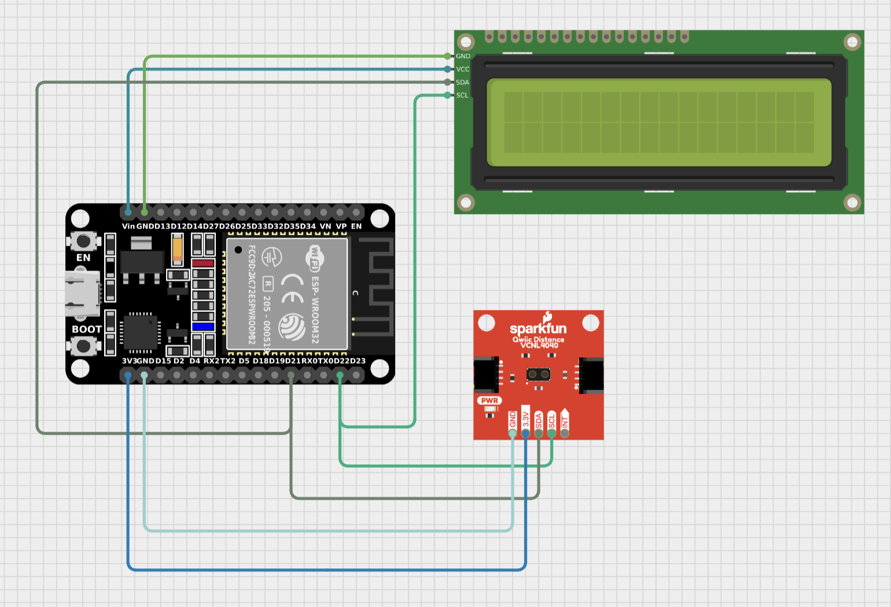
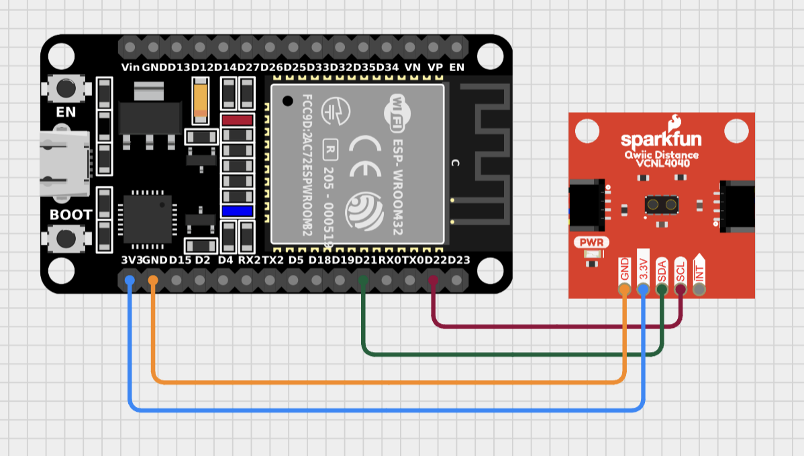
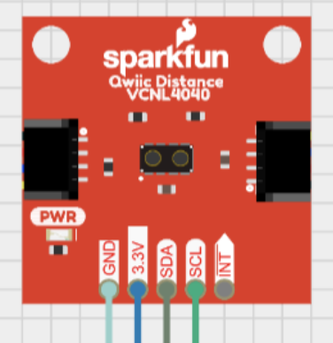
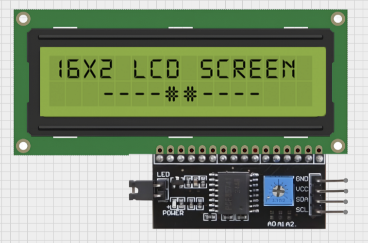
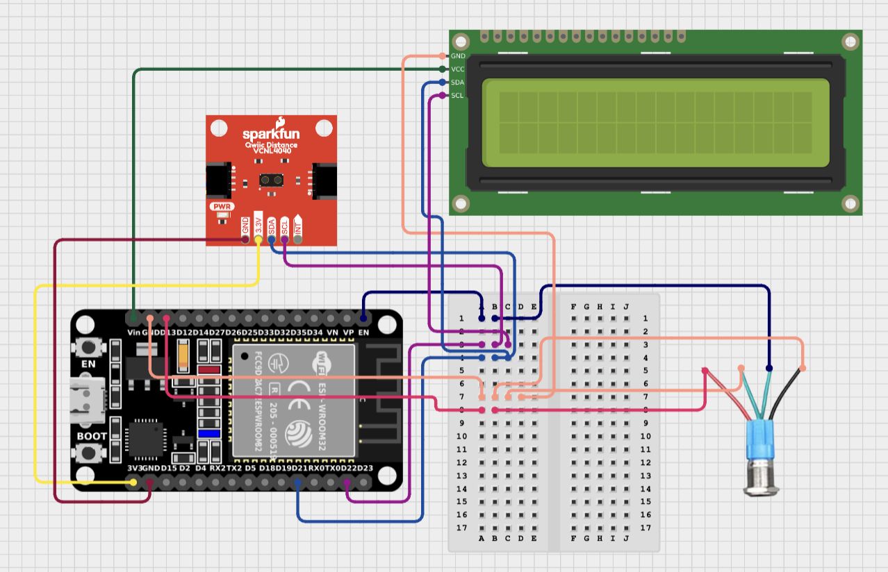
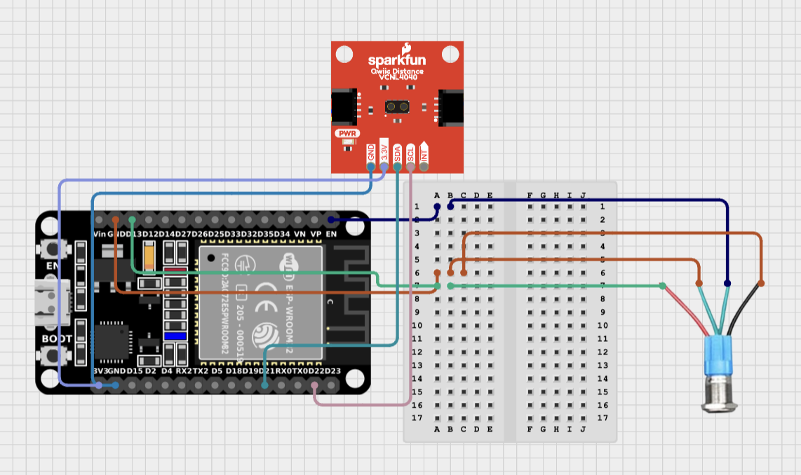

# 40-Yard Dash Sprint Timer 
Do you think you can run a faster 40-yard dash than a NFL player? If you want an affordable method to test it without using manual hand timing that's prone to human error, then try using this sprint timer inspired by the NFL Combine's 40-yard dash! This project is a NFL Combine inspired automated electronic sprint timer that uses ESP32s for communication, VL53L1X motion sensors, and a LCD screen that will display your final elapsed time. How about we use this sprint timer project to test if your speed can compete with a NFL player's speed!

| **Engineer** | **School** | **Area of Interest** | **Grade** |
|:--:|:--:|:--:|:--:|
| Kevin Y | Los Gatos High School | Electrical Engineering | Incoming Senior


  
# Modifications Milestone
<iframe width="560" height="315" src="https://www.youtube.com/embed/DaYLZZDMbpw?si=LKPVoEvAaq-o8uDf" title="YouTube video player" frameborder="0" allow="accelerometer; autoplay; clipboard-write; encrypted-media; gyroscope; picture-in-picture; web-share" referrerpolicy="strict-origin-when-cross-origin" allowfullscreen></iframe>

## Description
I only really made one modification to my project which was writing some code that would estimate the distance between the two ESP32s that I'm using for my sprint timer and print it on the serial monitor. It was just supposed to be an upgrade that will improve the overall quality of the entire project. No one wants to measure any long distances by hand and not everyone is going to have access to a football field or any field with distance markings, so this modification provides a way to accurately measure a distance you want to use for a time trial. 
## Estimating Distance using RSSI
I chose to use RSSI to estimate the distance between the ESPs because it only involved writing code and didn't require me to add or wire any new parts. Estimating distance using RSSI can be heavily affected by the surrounding environment, but in the case of my sprint timer, it will always be in a clear space without much interference from obstacles, so I always found it to be accurate. RSSI is a measurement of the signal strength of a WiFi signal. I set up some code to have an Access Point and a Client. The Access Point sends a WiFi signal from any distance to the client. Then, the client measures the RSSI from that signal and plugs it into the equation Distance = 10^((RSSI_1m - RSSI) / (10 * n)) to estimate the distance between the two ESPs. The "RSSI_1m" variable is the measured RSSI from a known distance of 1 meter. The "N" variable is the path loss exponent, and it generally fluctuates between 2 and 4 depending on the surrounding environment. A "N" value of ~2 would be used when the surrounding environment is free space, and a value of ~4 would be used when you're indoors or if there is heavy obstruction due to obstacles. 

# Final Milestone - Assembled Sprint Timer (Before modifications)
<iframe width="560" height="315" src="https://www.youtube.com/embed/ZFY-p4rMrP4?si=1zD0YqrdyeLHSIHi" title="YouTube video player" frameborder="0" allow="accelerometer; autoplay; clipboard-write; encrypted-media; gyroscope; picture-in-picture; web-share" referrerpolicy="strict-origin-when-cross-origin" allowfullscreen></iframe>

## Description - Final Milestone
My final milestone was to complete the sprint timer. It consisted of writing code to make the timing system, CADing cases to store everything, wiring, soldering, and assembling everything. With the code, I allowed the ESP32 to start timing using its internal clock when an object was detected by the VL53L1X motion sensor. The code ensures the VL53L1X only starts the ESP's internal clock and detects an object if something crosses a specific threshold of distance from the sensor. Even if there were another object, the code only made the VL53L1X detect an object if it was within the threshold. Once the starting motion sensor detects an object, the starting ESP32's internal clock starts and the ESP also sends a signal to the finishing setup ESP32 that allows the finishing motion sensor to detect objects. Once the finishing motion sensor detects an object, it sends a signal back to the starting setup which allows the starting ESP to stop its timer and allows it to record the elapsed time and print it on the LCD display. To start a new time trial, all you need to do is press the pushbutton on the starting setup to reset everything. After writing the code, I used Onshape to CAD a case and lid for each setup to store all the hardware. Both cases were boxes with holes to allow the motion sensors and pushbuttons to point outside. The starting setup had an extra hole at the top of the box to allow the LCD display to poke out so you could see it from the outside. To connect everything, I soldered one printed circuit board (PCB) with all my other hardware for each setup. The metal pushbuttons were also soldered to each PCB. Finally, for the assembly, I hot glued the VL53L1X to the little ledge I created above the hole which allowed to motion sensor to point outside and also stick to the box and tightened the pushbuttons to the holes I made for them. The starting setup followed the same assembly procedure, but I also needed to hot glue the LCD display to the ledge I made for it to allow the screen to stick outside. 
### Metal Pushbuttons
Both of the starting and finishing setups have a metal pushbutton wired to it. The pushbuttons are used to reset either the starting or finishing setup. My project uses the "Metal Pushbutton with Wires - Momentary (16mm, Red)" by SparkFun. They have five wires: red, green, blue, black, and white. The blue (Normally Closed wire or NC1) wire isn't needed when the pushbutton is only used to reset the setup. The red (+) wire connects to the positive power supply and provides a power path, and it's connected to the D13 pin on the ESP32 because when the pushbutton is idle, it keeps the GPIO pin at HIGH, and when it's pressed, it pulls the GPIO pin to low, which pulls the voltage down. The white (Normally Open or NO1) wire is always open unless the button is pushed, which only allows current to flow when the button is pressed. The NO1 wire is connected to the EN (RESET) pin on the ESP32, and this allows the ESP32 to reset because when the button is pressed, it allows current to flow which triggers the reset. The green (Common or C1) wire acts as the main connection for the power source and the starting point for the electrical circuit, and will direct current to either the normally open or closed terminals. The C1 wire is connected to GND (Ground) to allow a path for the current to flow from a power source. The black (-) wire also connects to GND because it provides the return path for any electrical current which completes the circuit. These four wires allow me to reset the ESP32 and thus the whole setup with just the push of a button. (Refer to Figures 5 and 6 to see fully assembled Start & Finish setup with pushbuttons)

## Challenges - Final Milestone
When I ran some test trials by just waving my hand over the motion sensors, the elapsed time was always inaccurate. Instead of resetting after each trial, the elapsed times kept adding up after each following test. At first, I thought it was an issue with my code, but when going through the code, the problem seemed to be due to offset between the internal clocks of both ESPs, which caused the inaccurate time recordings. At first, my code utilized the internal clocks of both ESPs and subtracted the time readings to get an elapsed time. Thus, when running tests, the final elapsed time would be inaccurate due to offset between the clocks of the two ESPs. To fix this, I had to change the code of both setups to only use one ESP's internal clock to eliminate error due to any offset. The plan was to only use the internal clock of the starting ESP when the starting motion sensor detected an object within the threshold. When motion was detected, the starting ESP would send a signal to the finishing ESP, to prepare the finishing motion sensor for detecting an object. Once the finishing motion sensor detected an object, it would send that time back to the starting ESP where it would display the final elapsed time on the LCD screen. This prevented any error due to offset because the original code calculated the elapsed time using the internal clock time readings of two ESP32s. The new code only utilizes the starting ESP's internal clock and directly uses it to find the elapsed time. The only change to the code was to swap some lines of code to its opposite setup's code. This challenge and what I did to get through it continues to show the importance of carefully going through code and adding comments to it to ensure you know the function of every line so its easy to make changes. 

# Second Milestone - Getting 2 ESP32s to communicate
<iframe width="560" height="315" src="https://www.youtube.com/embed/q5YQB9iJI4Q?si=sCi90vI5DvDdba0C" title="YouTube video player" frameborder="0" allow="accelerometer; autoplay; clipboard-write; encrypted-media; gyroscope; picture-in-picture; web-share" referrerpolicy="strict-origin-when-cross-origin" allowfullscreen></iframe>

## Description - 2nd Milestone
My 2nd milestone for my project was to establish communication between the two ESP32s. First, I ran some simple code to print some random text on the serial monitor just to ensure that there were no issues with my hardware (Refer to Challenges section for hardware issues). Next, I ran some code to try and verify if the two ESPs could communicate and transfer data. If it was successful, it would print "Sent with success" on the serial monitor. If the receiving ESP successfully received the data, it would print the whole struct message on the serial monitor. Finally, all I had to do was change the struct to include the motion sensor readings so it would be able to be sent to the receiving ESP32 by adding necessary libraries and changing the code to allow the VL53L1X to record distance readings. The finishing setup of my timer includes the receiving ESP32 connected with the finishing VL53L1X motion sensor (Refer to Figure 2). The starting setup includes the sending ESP32 connected with the starting VL53L1X and an LCD screen (Refer to Figure 1). I used ESP-NOW communication to allow communication between my devices. ESP-NOW is a connectionless WiFi communication protocol which allows direct peer-to-peer communication between two devices. It allows communication directly over MAC addresses, which is why I needed to find the MAC address of the receiving ESP32 in my previous milestone. Using ESP-NOW and I2C connections ensured efficient communication and verified that there was successful communication between my two ESP32s, and allows me to start working on the actual timing aspect of my project. 
### SparkFun VL53L1X Motion Sensor
My project uses two SparkFun VL53L1X motion sensors. These two sensors detect when someone starts and ends their sprint. The VL53L1X uses a VCSEL (Vertical Cavity Surface Emitting Laser) and measures the time it takes for the light to reflect back from the object that passes the sensor to determine its distance from the sensor. The VL53L1X can measure distances up to about 4 meters. The SparkFun VL53L1X communicates using I2C protocol. The four pins I used with the VL53L1X were Ground (GND), Power (3.3V), Serial Data (SDA), and Serial Clock (SCL) (Refer to Figure 3). The Serial Data pin creates a data line which allows the process of transmitting and receiving data, and the Serial Clock pin acts as a clock signal which synchronizes data transmission between the motion sensor and any other devices. The Ground pins establishes a common ground between all connected devices, and ensures a stable and consistent voltage. Finally, the power pin provides sufficient power for the VL53L1X, which uses 3.3V. In my project, I used an ESP32 as the master device, and when I want to start a time trial, my code allows the ESP32 to initiate a start condition which begins communication between the ESP and the VL53L1X. 
### 16x2 LCD Screen with I2C Interface
I used a 16x2 LCD Screen to display the elapsed time of any time trial using my project. The specific LCD display I used has an I2C module connected to it, which allows it to communicate using I2C protocol (Refer to Figure 4). The actual LCD screen works by controlling its alignment of liquid crystals which allow the LCD screen's backlight to pass through and create visible images. The LCD also has pins required for I2C protocol: GND, VCC (The power pin. This LCD uses 5V), SDA, and SCL. Just like any other device that uses I2C protocol, GND creates a common ground between every connected device, the power pin provides sufficient voltage from the power source, SDA creates the data line which enables communication between multiple devices, and SCL establishes a clock signal which synchronizes data transmission which ensures successful communication between devices. In my project, the starting setup includes an ESP32 connected with both a VL53L1X and a LCD display. The ESP acts as the master device, and allows communication between not only the devices of the setup, but also the other ESP32 I'm using which is in the finishing setup. My code initiates the start condition and can control the LCD display itself and what gets printed or doesn't get printed onto the screen. 

## Challenges - 2nd Milestone
I ran into a ton of challenges and setbacks while trying to achieve my 2nd milestone. Due to problems with the hardware I was initially working with, I switched to using ESP32s instead of ESP32-S2s and switched to an LCD I2C screen instead of the OLED screen. For this milestone, I used the approach of simplifying the whole process into many small steps. First, I tried to have one ESP32 send some text to the other ESP32, and it would print a success or failure message based on whether the transfer of information was successful or not. Following that, all I needed to do was to attach one of my VL53L1X sensors to the starting ESP32 and send its readings to the receiving ESP32. At first, ensuring all the code was correct was pretty frustrating, but once I started to go through every line of code one-by-one and learning to understand the function of each line, I was able to fix all my code and verify it. All of these challenges, from errors in my code to frustrating issues with my hardware, taught me this important process of trying to understand everything I was working with along with simplifying any big steps to make things easier and eliminate any major setbacks, and I'll continue to use this method to finish my project to ensure the creating process goes as smooth as possible. 
### 2nd Milestone Challenges - Hardware issues
Initially, I used ESP32-S2s and an OLED screen both created by SparkFun. However, when attempting to achieve communication between both ESP32-S2s, nothing seemed to work. I used the code for both the "Start" and "Finish" setups from the SparkFun website instructions for the sprint timer, but nothing worked. According to Arduino IDE, there was nothing wrong with the code. Still, the serial monitor would not print any confirmation that showed communication between the two ESP32-S2s. Additionally, when plugging in the OLED screen to a power source, it just would not turn on. Nothing seemed to be able to power it on. I used a sufficient power source and all the wiring was secure with the use of Qwiic wiring, but the OLED screen just wouldn't turn on. It still wouldn't turn on when I tried running some code provided by SparkFun that was supposed to print a logo on the OLED. By experiencing these setbacks, I concluded it was a hardware issue. However, I didn't know if the VL53L1X motion sensor worked or not. I wasn't able to test it because the ESP32-S2s didn't seem to work either, so I couldn't get any distance readings from it. Therefore, I had to find another way to test if the VL53L1X sensors worked or not. 
### 2nd Milestone Challenges - Overcoming these challenges
In order to test the motion sensor, I started off by using Arduino and I tried to get the motion sensor readings to print on the LCD. I was unsuccessful, so I switched to something simpler by ignoring the LCD and attempting to print the motion sensor readings onto the serial monitor. I tried going through every line of code to try understanding what each line did. Throughout that whole process, I added some comments to my code to help me remember the function of every line. Not only did that allow me to gain a better understanding of my code, but also allowed me to fix everything and verify that it worked. Now I was easily able to get the VL53L1X to print its distance readings on the serial monitor, and changing the code to make it print on the LCD also didn't come with too much difficulty. Once I finished, I was able to confirm that the motion sensor and the LCD worked. 

## Next Steps - 2nd Milestone
Now that I've managed to get my 2 ESP32s to communicate, my next steps are going to code the actual timing aspect of my project to complete a timer that starts and finishes using motion sensor detection. Once that is finished, my project is essentially done, but I will still need to do a couple extra steps like cadding and 3d printing covers to store everything. Additionally, I'll try and make modifications just to improve on my project. 

## Figure 1 - Starting Setup Schematic

## Figure 2 - Finishing Setup Schematic

## Figure 3 - SparkFun VL53L1X Schematic

## Figure 4 - LCD Screen Schematic

## Figure 5 - Final Starting Setup with Pushbuttons

## Figure 6 - Final Finishing Setup with Pushbuttons


# First Milestone - Finding the MAC Address of one ESP32-S2
<iframe width="560" height="315" src="https://www.youtube.com/embed/4wfWdBVm-4M?si=NU4qoyfDkIXT_a_3" title="YouTube video player" frameborder="0" allow="accelerometer; autoplay; clipboard-write; encrypted-media; gyroscope; picture-in-picture; web-share" referrerpolicy="strict-origin-when-cross-origin" allowfullscreen></iframe>

## Description - 1st Milestone
My first milestone for my Sprint Timer intensive project was to find the Media Access Control(MAC) Address for one SparkFun Thing Plus ESP32-S2. I was provided two of these for the whole project, but we only need to find the MAC address for one of them. A MAC address is a specific 12-digit hexademical number that identifies a specific device on a network. MAC addresses are unique to a device and typically do not change and are hard-coded into any specific device's hardware. Finding the MAC address is important because you will need one of the ESP32-S2's MAC addresses in order to allow both ESPs to communicate between each other, which is needed because they will be connected to motion sensors that will communicate to record the elapsed time for a sprint. The MAC address allows two devices to communicate because it gives a specific designation to one device and allows the network to distinguish between the two devices. In order to obtain the MAC address, I had to run some code through Arduino IDE which would list out the MAC address for the specific ESP32-S2 that I connected to my computer. If the code is correct, the output box will show the MAC address for the hardware that is connected to my computer. The MAC address will be used later in the project to allow both ESPs to communicate with each other, which is necessary to allow this project to work. 

## Challenges - 1st Milestone
I only really ran into one challenge while trying to obtain the MAC address. When first installing the Arduino IDE, I used the ESP32 Starting Guide that was linked to the BlueStamp Student Wiki to set everything up. However, what I didn't realize was that the BlueStamp tutorial was for an ESP32. My project uses ESP32-S2, not ESP32. Thus, when I copied the code from the website onto Arduino IDE and uploaded it, I ended up getting an error that said my code failed uploading because the chip that was connected was ESP32-S2, not ESP32. All I had to do was to change the Arduino IDE ESP32 Dev Module into the ESP32-S2 Dev Module. At first, I was clueless on what to do. It was not until next class when I payed more attention to what I already had on Arduino IDE when I realized that all I had to do was change the Dev Module to work with ESP32-S2. This challenge wasn't a really big roadblock by any means, but it had me very frustrated at first. From this, I learned to pay more attention and really analyze everything I already have and what I could possibly change in my code. 

## Next Steps - 1st Milestone
Now that I have obtained the MAC address for one ESP32-S2, the next steps I need to take will be to connect the ESP32-S2s to their respective hardware using the Qwiic connectors to create the starting and ending motion sensors. Once I've done that, I will need to verify the "Start" and "Finish" Codes for the starting and ending setups. Once the "Start" and "Finish" codes have been verified to work, that will have completed my 2nd milestone, which is to verify all the code.

# Bill of Materials
| **Part** | **Note** | **Price** | **Link** |
|:--:|:--:|:--:|:--:|
| (2) Metal Pushbutton with Wires (16mm) | Resets either of the starting or finishing setups when you press the button | $8.95 | <a href="https://www.sparkfun.com/metal-pushbutton-momentary-16mm-red.html"> Link </a> |
| 2Pack ESP32 Development Board CP2102 | Allows communication between both the starting and finishing setups for the sprint timer | $12.99 | <a href="https://www.amazon.com/Hosyond-Development-Bluetooth-Microcontroller-Compatible/dp/B09XDMVS9N/ref=sr_1_22_sspa?crid=3J11QQGHEG16C&dib=eyJ2IjoiMSJ9.is-SH_RLGHiZZUrqvTWU_JNOvdR7aKbmm4bb_y393N6jud_4gMIiqQQY-xb6H2GuvezVlU_delmFVm9Oexf_R6g0-RF67ww5hI4c8gPCBnY9VLfm-z9vuyqYhkrb4rjV2HC7t8_wDfdbWkkOiqLcEuCcn_zZVFSIvVcsNNqXS3TpkjOCIsvc5KxUoo_4iwKnZpov2nnurYeClr0k8efW12wn2qQxqotFQmIdnMbD5hU.8AMkbfskSULbXDXii1DfkNUzcJcAn97uuOVhUJgsfdg&dib_tag=se&keywords=esp32&qid=1751583893&sprefix=esp32%2Caps%2C181&sr=8-22-spons&sp_csd=d2lkZ2V0TmFtZT1zcF9idGY&th=1"> Link </a> |
| (2) SparkFun Distance Sensor Breakout - 4mm, VL53L1X | Detects an object crossing the sensor within a threshold which will start or end the sprint timer | $29.95 | <a href="https://www.sparkfun.com/sparkfun-distance-sensor-breakout-4-meter-vl53l1x-qwiic.html"> Link </a> | 
| 16x2 LCD Display with I2C Interface | Displays the elapsed time of a sprint | $7.00 | <a href="https://store-usa.arduino.cc/products/16x2-lcd-display-with-i-c-interface"> Link </a> | 
| (2) Anker PowerCore Slim 10K | Power banks to provide power to the starting and finishing setups | $25.99 | <a href="https://www.anker.com/products/a1229"> Link </a> | 

# Other Resources
Original SparkFun Sprint Timer Documentation: <a href="https://learn.sparkfun.com/tutorials/wireless-timing-project"> Link </a> 
  Note: I didn't really use much of the SparkFun documentation other than for the metal pushbuttons because as I said when talking about my 2nd milestone challenges, I switched from using the ESP32-S2 and OLED screen due to them not working. Most of the project was made from scratch due to the fact I couldn't use the SparkFun documentation and because of the lack of other documentation specific to my project's goals. 

<!--- One of the best parts about Github is that you can view how other people set up their own work. Here are some past BSE portfolios that are awesome examples. You can view how they set up their portfolio, and you can view their index.md files to understand how they implemented different portfolio components.
- [Example 1](https://trashytuber.github.io/YimingJiaBlueStamp/)
- [Example 2](https://sviatil0.github.io/Sviatoslav_BSE/)
- [Example 3](https://arneshkumar.github.io/arneshbluestamp/)
To watch the BSE tutorial on how to create a portfolio, click here. --->

# Starter Project: RGB Slider
<iframe width="560" height="315" src="https://www.youtube.com/embed/QllSI647z14?si=3Erbfct-ZkgH6jQq" title="YouTube video player" frameborder="0" allow="accelerometer; autoplay; clipboard-write; encrypted-media; gyroscope; picture-in-picture; web-share" referrerpolicy="strict-origin-when-cross-origin" allowfullscreen></iframe> 

## Description
I chose the RGB Slider for my starter project. The starter project is used to practice soldering while creating a little project, and this project definitely helped me learn, practice, and get better at soldering. The RGB Slider contains a USB port, LED lights, and 3 sliders. All these materials will need to be soldered to the board. The USB port allows the RGB Slider to work by allowing it to be plugged into an external power source. A good power source could be your computer. The LED contains 3 colored lights: Red, blue, and green. Plugging in the RGB Slider into a power source and sliding the sliders on the board will cause the LEDs to either turn on or turn off. The 3 sliders on the RGB slider allow the lights to turn on or off, and you can choose which color you want to light up by using the corresponding labeled slider. Having multiple sliders on can also cause some of the colors in the light to mix. For example, having all 3 sliders on makes the light white. 
## Challenges
The main challenge that came with the starter project was soldering. Before working on this project, I had never soldered anything before, so I had to learn how to do so before starting to create my RGB Slider. I was given a breadboard to practice learning how to solder, but I struggled with it a lot. At first, getting the solder into that cone-like or Hershey's Kisses shape was very difficult for me. However, after a lot of practice, I was able to consistently get that cone-like shape. I started the starter project a lot later than all my classmates since learning and practicing soldering took a very long time, but it allowed the soldering on my RGB Slider to be good. 
## Next Steps
Now that my starter project is completed, I have gained more knowledge and practice with soldering which will help when I eventually get to the soldering portion of my intensive project. I will now be able to start working on my intensive project, which is the 40-Yard Dash Sprint Timer. 

# Appendix - Code
## Milestone 1 Code - Finding the MAC address
```
#include "WiFi.h"

void setup(){
  Serial.begin(115200); // Initializes serial communication
}

void loop(){
  WiFi.mode(WIFI_STA);
  Serial.print("The MAC address for this board is: ");
  Serial.println(WiFi.macAddress());
  while(1){     // This holds the loop, so it doesn't 
    }           // print the info a million times.
}
```
## Milestone 2 Code - Sending ESP32
```
#include <esp_now.h>
#include <WiFi.h>
#include "SparkFun_VL53L1X.h"
#include <Wire.h>
// MAC Address of the receiver ESP32
uint8_t broadcastAddress[] = {0x00, 0x4B, 0x12, 0x2F, 0xBD, 0x30};
// Define struct for sending data
typedef struct struct_message {
  char a[32];
  int b;     // Will hold the distance reading
  float c;
  bool d;
} struct_message;

struct_message myData;
// VL53L1X setup
SFEVL53L1X distanceSensor;
// ESP-NOW peer info
esp_now_peer_info_t peerInfo;

// Callback when data is sent
void OnDataSent(const uint8_t *mac_addr, esp_now_send_status_t status) {
  Serial.print("\r\nLast Packet Send Status:\t");
  Serial.println(status == ESP_NOW_SEND_SUCCESS ? "Delivery Success" : "Delivery Fail");
}

void setup() {
  Serial.begin(115200);
  delay(1000);  // Allow time for serial to start

  // Start I2C
  Wire.begin();

  // Initialize VL53L1X
  if (distanceSensor.begin() != 0) {
    Serial.println("VL53L1X not detected");
    while (1);
  }
  Serial.println("VL53L1X ready");

  // Set up WiFi as STA
  WiFi.mode(WIFI_STA);

  // Init ESP-NOW
  if (esp_now_init() != ESP_OK) {
    Serial.println("Error initializing ESP-NOW");
    return;
  }
  // Register callback and peer
  esp_now_register_send_cb(OnDataSent);
  memcpy(peerInfo.peer_addr, broadcastAddress, 6);
  peerInfo.channel = 0;
  peerInfo.encrypt = false;

  if (esp_now_add_peer(&peerInfo) != ESP_OK) {
    Serial.println("Failed to add peer");
    return;
  }
}

void loop() {
  // Start a ranging measurement
  distanceSensor.startRanging();

  // Wait for data to be ready
  while (!distanceSensor.checkForDataReady()) {
    delay(1);
  }

  // Read distance in mm
  int distance = distanceSensor.getDistance();

  // Stop ranging to save power
  distanceSensor.clearInterrupt();
  distanceSensor.stopRanging();

  // Populate the struct
  strcpy(myData.a, "Distance reading");
  myData.b = distance;
  myData.c = 1.2;      // You can replace this with more sensor data if needed
  myData.d = false;    // Or use this to indicate some event

  // Send the data
  esp_err_t result = esp_now_send(broadcastAddress, (uint8_t *) &myData, sizeof(myData));

  if (result == ESP_OK) {
    Serial.print("Sent distance: ");
    Serial.println(distance);
  } else {
    Serial.println("Error sending the data");
  }

  delay(2000);  // Delay between readings
}
```
## Milestone 2 Code - Receiving ESP32
```
#include <esp_now.h>
#include <WiFi.h>
#include "SparkFun_VL53L1X.h"
#include <Wire.h>

// Structure example to receive data
// Must match the sender structure
typedef struct struct_message {
    char a[32];
    int b;
    float c;
    bool d;
} struct_message;

// Create a struct_message called myData
struct_message myData;

// callback function that will be executed when data is received
void OnDataRecv(const uint8_t * mac, const uint8_t *incomingData, int len) {
  memcpy(&myData, incomingData, sizeof(myData));
  Serial.print("Bytes received: ");
  Serial.println(len);
  Serial.print("Char: ");
  Serial.println(myData.a);
  Serial.print("Int: ");
  Serial.println(myData.b);
  Serial.print("Float: ");
  Serial.println(myData.c);
  Serial.print("Bool: ");
  Serial.println(myData.d);
  Serial.println();
}
 
void setup() {
  // Initialize Serial Monitor
  Serial.begin(115200);

  Serial.println("ESP-NOW Receiver Initialized, waiting for data...");
  
  // Set device as a Wi-Fi Station
  WiFi.mode(WIFI_STA);

  // Init ESP-NOW
  if (esp_now_init() != ESP_OK) {
    Serial.println("Error initializing ESP-NOW");
    return;
  }
  
  // Once ESPNow is successfully Init, we will register for recv CB to
  // get recv packer info
  esp_now_register_recv_cb(OnDataRecv);
}
 
void loop() {

}
```
## Final Milestone Code - Starting/Sending Setup Code
```
#include <esp_now.h>                                  // Library for ESP-NOW communication
#include <WiFi.h>                             
#include <Wire.h>                                     // I2C communication library
#include <LiquidCrystal_I2C.h>                        // LCD I2C library
#include "SparkFun_VL53L1X.h"                         // Sparkfun VL53L1X distance sensor library

LiquidCrystal_I2C lcd(0x27, 16, 2);                   // Initialize 16x2 LCD. I2C Address: 0x27
SFEVL53L1X distanceSensor;                            // Create instance of distance sensor

uint8_t finishMac[] = {0x00, 0x4B, 0x12, 0x2F, 0xBD, 0x30}; // MAC address of finishing ESP32

typedef struct struct_message {
  char msgType[10];                                   // Message says either "START" or "STOP"
  unsigned long timestamp;                            // Timestamp in milliseconds
} struct_message;

struct_message messageToSend;                         // Message to send to finish ESP32
bool timingStarted = false;                           // Indicates if timing has started
unsigned long startTime = 0;                          // Variable to store start time

// Callback function when data is received from another ESP32
void OnDataRecv(const uint8_t * mac, const uint8_t *incomingData, int len) {
  struct_message received;                            // Temporary structure to hold incoming data
  memcpy(&received, incomingData, sizeof(received));  // Copy received data into structure

  // If STOP message is received and timing was started
  if (strcmp(received.msgType, "STOP") == 0 && timingStarted) {
    unsigned long endTime = millis();                 // Record current time as end time
    unsigned long elapsed = endTime - startTime;      // Calculate elapsed time

    lcd.clear();                                      // Clear LCD
    lcd.setCursor(0, 0);                              
    lcd.print("Time:");                               
    lcd.setCursor(6, 0);                              
    lcd.print(elapsed / 1000.0, 2);                   // Display elapsed time in seconds (2 decimals)
    lcd.print(" sec");                                // Units

    Serial.print("Elapsed Time: ");                   // Prints elapsed time to Serial Monitor
    Serial.println(elapsed);

    timingStarted = false;                            // Resets timing
  }
}

void setup() {
  Serial.begin(115200);                               // Start Serial Monitor
  Wire.begin();                                       // Initialize I2C communication
  lcd.init();                                         // Initialize LCD screen
  lcd.backlight();                                    // Turn on LCD backlight
  lcd.setCursor(0, 0);                        
  lcd.print("Ready...");                      

  if (distanceSensor.begin() != 0) {                  // Initialize distance sensor
    Serial.println("Sensor fail");                    // If fails, prints an error message
    while (1);                                        
  }

  distanceSensor.setDistanceModeLong();               // Set sensor to long-distance mode
  distanceSensor.setTimingBudgetInMs(33);
  distanceSensor.setIntermeasurementPeriod(33);
  distanceSensor.startRanging();                      // Start measuring distance

  WiFi.mode(WIFI_STA);                                // Set WiFi to Station mode (required for ESP-NOW)
  WiFi.disconnect();                                  // Disconnect from any previous WiFi

  if (esp_now_init() != ESP_OK) {                     // Initialize ESP-NOW
    Serial.println("ESP-NOW failed");                 // Print error if failed
    return;                                   
  }

  esp_now_register_recv_cb(OnDataRecv);               // Register callback for receiving data

  esp_now_peer_info_t peerInfo = {};                  // Create peer info struct
  memcpy(peerInfo.peer_addr, finishMac, 6);           // Set peer MAC address
  peerInfo.channel = 0;                               
  peerInfo.encrypt = false;                           

  if (!esp_now_add_peer(&peerInfo)) {                 // Add the peer
    Serial.println("Peer added");                     // Confirm peer was added
  }
}

void loop() {
  // If timing hasn't started and new distance data is ready
  if (!timingStarted && distanceSensor.checkForDataReady()) {
    uint16_t distance = distanceSensor.getDistance(); // Read distance in mm
    distanceSensor.clearInterrupt();                  // Clear sensor interrupt

    Serial.print("Distance: ");                       
    Serial.println(distance);                         // Debug: print distance

    if (distance >= 40 && distance < 300) {           // Threshold of 40 to 300mm (Won't start timing unless an object makes it within the threshold)
      startTime = millis();                           // Records time
      messageToSend.timestamp = startTime;            // Include timestamp in message
      strcpy(messageToSend.msgType, "START");         

      esp_now_send(finishMac, (uint8_t *)&messageToSend, sizeof(messageToSend)); // Send start message

      lcd.clear();                                    
      lcd.setCursor(0, 0);
      lcd.print("Timing...");                         // Display "Timing..." on LCD. Indicates that timer is running
      Serial.println("Start detected");              
      timingStarted = true;                           // Flag that timing has started
    }
  }
}
```
## Final Milestone Code - Finishing/Receiving Setup Code
```
#include <esp_now.h>                          // ESP-NOW communication library
#include <WiFi.h>                             // Required for setting WiFi mode
#include <Wire.h>                             // I2C communication library
#include "SparkFun_VL53L1X.h"                 // VL53L1X distance sensor library

SFEVL53L1X distanceSensor;                    // Create instance of distance sensor

uint8_t startMac[] = {0x38, 0x18, 0x2B, 0x89, 0xEE, 0xBC}; // MAC address of starting ESP32

typedef struct struct_message {
  char msgType[10];                           // Message type: "START" or "STOP"
  unsigned long timestamp;                    
} struct_message;

bool objectDetected = false;                  // Flag to prevent multiple triggers

void setup() {
  Serial.begin(115200);                       // Start Serial Monitor
  Wire.begin();                               // Initialize I2C communication

  if (distanceSensor.begin() != 0) {          // Initialize sensor
    Serial.println("Sensor fail");            // Print error if initialization fails
    while (1);                                
  }

  distanceSensor.setDistanceModeLong();       // Set long range mode
  distanceSensor.setTimingBudgetInMs(33);
  distanceSensor.setIntermeasurementPeriod(33);
  distanceSensor.startRanging();              // Start distance measurements

  WiFi.mode(WIFI_STA);                        // Set WiFi mode to Station
  WiFi.disconnect();                          // Disconnects from any previous WiFi connections

  if (esp_now_init() != ESP_OK) {             // Initialize ESP-NOW
    Serial.println("ESP-NOW failed");         // If it fails, print error message and stop
    return;
  }

  esp_now_peer_info_t peerInfo = {};          // Create peer info struct
  memcpy(peerInfo.peer_addr, startMac, 6);    // Set peer address (start ESP32)
  peerInfo.channel = 0;                       // Default channel
  peerInfo.encrypt = false;                   

  esp_now_add_peer(&peerInfo);                // Add peer (start ESP32)
}

void loop() {
  if (distanceSensor.checkForDataReady()) {           // Check if new distance data is available
    uint16_t distance = distanceSensor.getDistance(); // Read distance
    distanceSensor.clearInterrupt();                  // Clear interrupt for next reading

    Serial.print("Distance: ");               
    Serial.println(distance);                         // Print distance to Serial

    if (distance  >= 40 && distance < 300 && !objectDetected) {          // 40mm to 300mm threshold to detect an object
      struct_message stopMsg;                         // Create STOP message
      strcpy(stopMsg.msgType, "STOP");                // Set message type
      stopMsg.timestamp = millis();                   // Optional timestamp

      // Send STOP signal back to start ESP32
      esp_err_t result = esp_now_send(startMac, (uint8_t *)&stopMsg, sizeof(stopMsg));
      if (result == ESP_OK) {
        Serial.println("Stop signal sent");           // Confirm send
      } else {
        Serial.print("Send failed: ");                // Reports failure
        Serial.println(result);
      }

      objectDetected = true;                          // Mark object as detected
    } else if (distance > 300) {                      // If object is out of range (Won't be declared an object)
      objectDetected = false;                         // Reset detection flag
    }
  }
}
```
## Modification Code - Access Point Code
```
#include <WiFi.h>

// Network credentials
const char* ssid = "ESP32_DISTANCE_AP";
const char* password = "12345678";

void setup() {
  Serial.begin(115200);
  delay(1000);
 
  Serial.println("Setting up ESP32 as Access Point...");
 
  // Set WiFi mode to Access Point
  WiFi.mode(WIFI_AP);
 
  // Configure Access Point
  WiFi.softAP(ssid, password);
 
  // Print AP IP address
  IPAddress IP = WiFi.softAPIP();
  Serial.print("AP IP address: ");
  Serial.println(IP);
 
  Serial.println("Access Point started!");
  Serial.println("SSID: " + String(ssid));
  Serial.println("Waiting for connections...");
}

void loop() {
  // Check connected clients
  int clients = WiFi.softAPgetStationNum();
  static int lastClients = -1;
 
  if (clients != lastClients) {
    Serial.println("Connected clients: " + String(clients));
    lastClients = clients;
  }
 
  delay(2000);
}
```
## Modification Code - Client Code
```
#include <WiFi.h>

// Target network to measure distance to
const char* targetSSID = "ESP32_DISTANCE_AP";
const char* password = "12345678";
const int measuredPower = -40;

// Smoothing parameters
const int BUFFER_SIZE = 10;
int rssiBuffer[BUFFER_SIZE];
float distanceBuffer[BUFFER_SIZE];
int bufferIndex = 0;
bool bufferFull = false;

// Exponential Moving Average
float rssiEMA = 0;
float distanceEMA = 0;
const float alpha = 0.3; // Smoothing factor (0.1 = heavy smoothing, 0.9 = light smoothing)

// Outlier detection parameters
float lastValidDistance = 0;
const float MAX_CHANGE_PERCENT = 50.0; // Reject changes > 50%
const float MIN_DISTANCE = 0.1;        // Minimum realistic distance (10cm)
const float MAX_DISTANCE = 50.0;       // Maximum realistic distance (50m)
const int MIN_RSSI = -100;             // Minimum realistic RSSI
const int MAX_RSSI = -10;              // Maximum realistic RSSI

void setup() {
  Serial.begin(115200);
  delay(1000);
 
  Serial.println("ESP32 Distance Measurement - Receiver");
  Serial.println("Connecting to target AP...");
 
  WiFi.mode(WIFI_STA);
  WiFi.begin(targetSSID, password);
 
  // Wait for connection
  while (WiFi.status() != WL_CONNECTED) {
    delay(500);
    Serial.print(".");
  }
 
  Serial.println("\nConnected! Starting RSSI monitoring...");
  delay(2000); // Give time to switch to Serial Plotter
}

void loop() {
  // Get RSSI of connected network - much faster than scanning!
  if (WiFi.status() == WL_CONNECTED) {
    int rssi = WiFi.RSSI();
   
    float rawDistance = distanceCalculation(rssi);
   
    // Check if this reading should be rejected
    bool isValid = isValidReading(rssi, rawDistance);
   
    // Apply smoothing algorithms (only if valid, otherwise use last valid)
    float movingAvgDistance = getMovingAverage(rssi, rawDistance);
    float emaDistance = getExponentialMovingAverage(rssi, rawDistance);
    float kalmanDistance = isValid ? getKalmanFiltered(rawDistance) : getKalmanFiltered(lastValidDistance);
   
    // Option 1: Show all for comparison with outlier detection status
    Serial.print("RSSI: ");
    Serial.print(rssi);
    Serial.print(" ,Raw:");
    Serial.print(rawDistance);
    Serial.print(",MovingAvg:");
    Serial.print(movingAvgDistance);
    Serial.print(",EMA:");
    Serial.print(emaDistance);
    Serial.print(",Kalman:");
    Serial.print(kalmanDistance);
    Serial.print(",Valid:");
    Serial.println(isValid ? 1 : 0); // 1 = valid, 0 = outlier rejected
   
    // Option 2: Show just cleaned data (uncomment preferred)
    // if (isValid) {  // Only print valid readings
    //   Serial.print("RSSI:");
    //   Serial.print(rssi);
    //   Serial.print(",Distance:");
    //   Serial.println(emaDistance);
    // }
   
  } else {
    Serial.println("Disconnected");
  }
 
  delay(100);
}

float distanceCalculation(int rssi) {
  float rssi_1m = measuredPower;  // RSSI at 1 meter (calibrate this!)
  float pathLoss = 2.0; // Environment factor
 
  // Distance = 10^((RSSI_1m - RSSI) / (10 * pathLoss))
  float distance = pow(10, (rssi_1m - rssi) / (10 * pathLoss));
  return distance;
}

// Outlier Detection Functions
bool isValidRSSI(int rssi) {
  return (rssi >= MIN_RSSI && rssi <= MAX_RSSI);
}

bool isValidDistance(float distance) {
  return (distance >= MIN_DISTANCE && distance <= MAX_DISTANCE);
}

bool isReasonableChange(float newDistance) {
  if (lastValidDistance == 0) return true; // First reading
 
  float changePercent = abs(newDistance - lastValidDistance) / lastValidDistance * 100.0;
  return (changePercent <= MAX_CHANGE_PERCENT);
}

// Combined outlier detection
bool isValidReading(int rssi, float distance) {
  return isValidRSSI(rssi) && isValidDistance(distance) && isReasonableChange(distance);
}
// Moving Average Filter (now with outlier rejection)
float getMovingAverage(int newRssi, float newDistance) {
  // Only add to buffer if it's a valid reading
  if (isValidReading(newRssi, newDistance)) {
    rssiBuffer[bufferIndex] = newRssi;
    distanceBuffer[bufferIndex] = newDistance;
   
    bufferIndex = (bufferIndex + 1) % BUFFER_SIZE;
    if (bufferIndex == 0) bufferFull = true;
   
    lastValidDistance = newDistance; // Update last valid reading
  }
 
  // Calculate average from valid readings only
  int count = bufferFull ? BUFFER_SIZE : bufferIndex;
  if (count == 0) return lastValidDistance; // No valid readings yet
 
  float distanceSum = 0;
  for (int i = 0; i < count; i++) {
    distanceSum += distanceBuffer[i];
  }
 
  return distanceSum / count;
}


// Exponential Moving Average Filter (with outlier rejection)
float getExponentialMovingAverage(int newRssi, float newDistance) {
  // Only update if it's a valid reading
  if (isValidReading(newRssi, newDistance)) {
    if (rssiEMA == 0) { // First valid reading
      rssiEMA = newRssi;
      distanceEMA = newDistance;
    } else {
      rssiEMA = alpha * newRssi + (1 - alpha) * rssiEMA;
      distanceEMA = alpha * newDistance + (1 - alpha) * distanceEMA;
    }
    lastValidDistance = newDistance;
  }
 
  return distanceEMA;
}

// Kalman Filter (simplified)
float kalmanGain = 0.5;
float estimatedDistance = 0;
float errorCovariance = 1;

float getKalmanFiltered(float measurement) {
  if (estimatedDistance == 0) {
    estimatedDistance = measurement;
    return estimatedDistance;
  }
 
  // Prediction step (assume no change)
  float predictedDistance = estimatedDistance;
  float predictedError = errorCovariance + 0.1; // Process noise
 
  // Update step
  kalmanGain = predictedError / (predictedError + 0.5); // Measurement noise
  estimatedDistance = predictedDistance + kalmanGain * (measurement - predictedDistance);
  errorCovariance = (1 - kalmanGain) * predictedError;
 
  return estimatedDistance;
}
```
